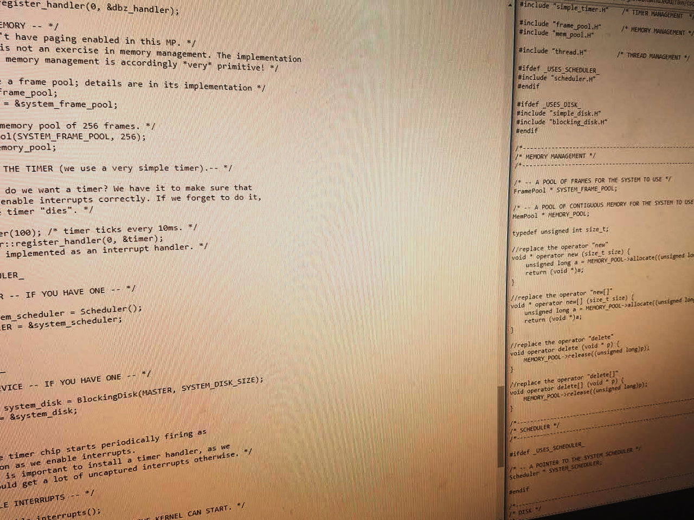

<!-- Banner -->
<section id="banner">

## {{ site.title }}

{{ site.description}}

<a href="#one" class="more scrolly">Learn More</a>
</section>

<!-- Hub -->
<section id="one" class="wrapper style1 special">

<header class="major" markdown="1">
## What brings you here?

I have a number of pages you may be interested in. Either access them from the top bar, or keep scrolling for more details.
</header>

</section>

<!-- Two -->
<section id="two" class="wrapper alt style2">

<section class="spotlight">

## Dungeons and Dragons

I run 5th edition Dungeons and Dragons! Go here to get access to resources, campaigns, and table rules!

</section>

<section class="spotlight">

## Personal Projects

As I work on various projects, I will add a sample from them here. Stay tuned for more that I am doing.

</section>

<section class="spotlight">

## About Me

A short bit about my life, hobbys, and the like. I may add more, but I'm not good at talking about myself.

</section>

</section>

<!-- CTA -->
<section id="cta" class="wrapper style4">
    

		<a href="#" class="button fit">Back to Top</a>
    

</section>
